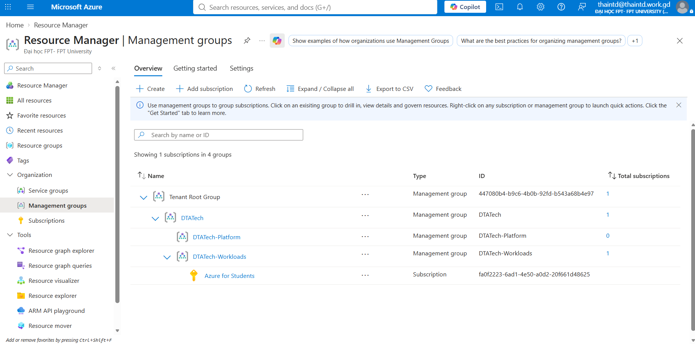
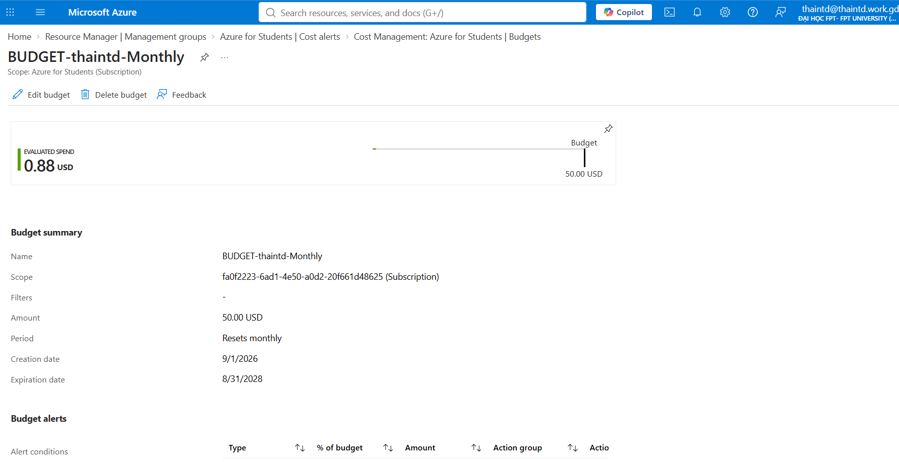
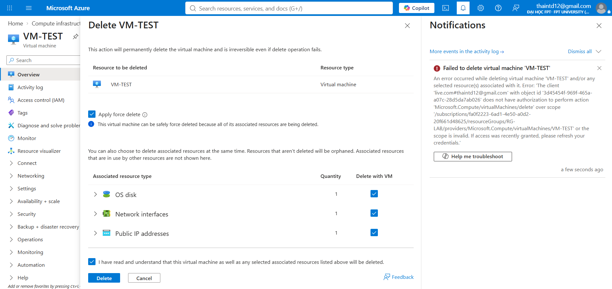
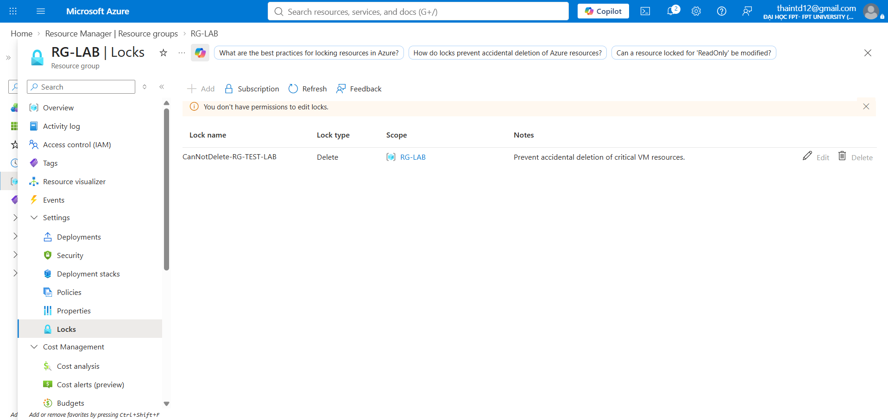
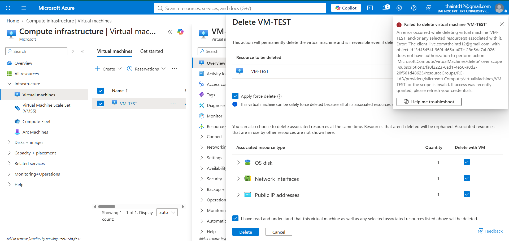

# Phase 1 — Governance Foundation

Thiết lập nền tảng quản trị trước khi dựng bất kỳ resource nào: kiểm soát chi phí, phân cấp quản lý, chính sách bắt buộc, và cơ chế chống xóa nhầm.

## Nội dung triển khai

**Management Groups** — phân cấp quản lý theo mô hình doanh nghiệp (`Tenant Root Group` → `DTATech` → `DTATech-Platform` / `DTATech-Workloads`), subscription lab nằm dưới `DTATech-Workloads`.

**Budget & Cost Alert** — thiết lập ngân sách và cảnh báo chi phí để kiểm soát subscription Azure for Students, tránh vượt credit ngoài ý muốn.

**RBAC (Role-Based Access Control)** — thử nghiệm giới hạn quyền, xác nhận đúng hành vi Azure khi 1 thao tác bị chặn do thiếu quyền (custom role hoạt động đúng như thiết kế).

**Resource Lock** — khóa resource quan trọng ở mức `CanNotDelete`, verify bằng cách thử xóa và bị chặn.

## Kỹ năng thể hiện
Management Groups hierarchy, Azure Policy, Custom RBAC role, Resource Lock, Cost Management & Budget alert — nền tảng governance theo chuẩn enterprise landing zone.
