# Phase 2 — Networking: Hub-Spoke Architecture

Dựng mô hình mạng hub-spoke chuẩn doanh nghiệp: 1 VNet hub trung tâm (chứa Bastion, dịch vụ chia sẻ) peering với các VNet spoke (prod, dev) tách biệt theo môi trường.

## Kiến trúc

```
        ┌─────────────────────┐
        │   vnet-hub-prod-jap  │
        │   10.0.0.0/16         │
        │  • AzureBastionSubnet │
        │  • GatewaySubnet      │
        │  • snet-shared        │
        └──────────┬───────────┘
             peering│peering
        ┌───────────┴───────────┐
        ▼                       ▼
┌───────────────┐      ┌───────────────┐
│ vnet-spoke-prod│      │ vnet-spoke-dev │
│  snet-app      │      │  snet-app      │
│  snet-data     │      └───────────────┘
└───────────────┘
```

## Nội dung triển khai

**Virtual Networks** — 3 VNet theo mô hình hub-spoke.

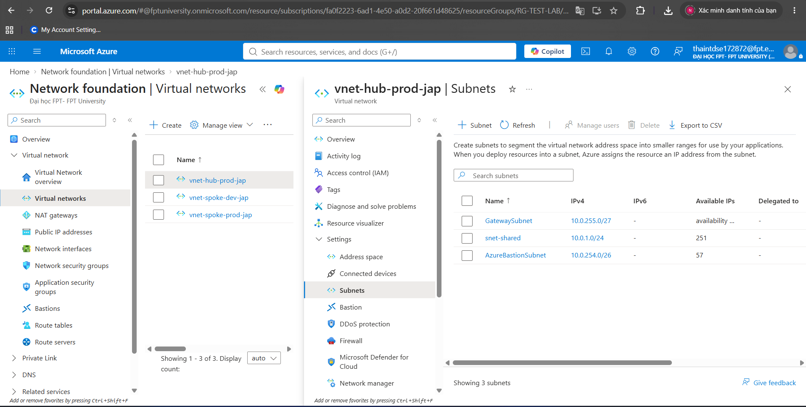
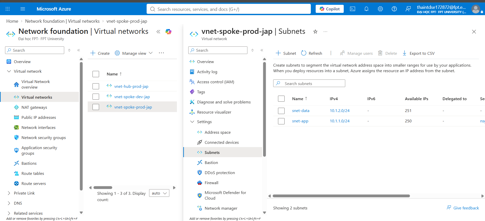
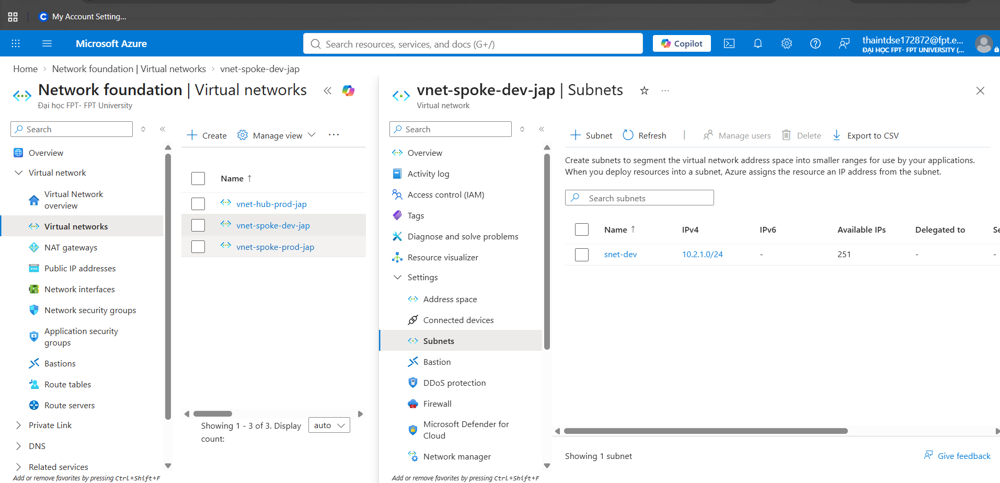
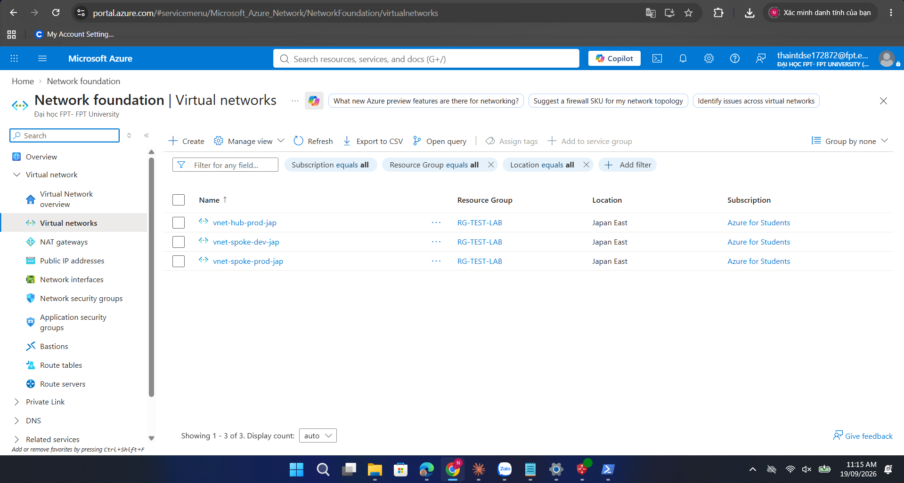

**VNet Peering** — kết nối 2 chiều giữa hub và spoke-prod.

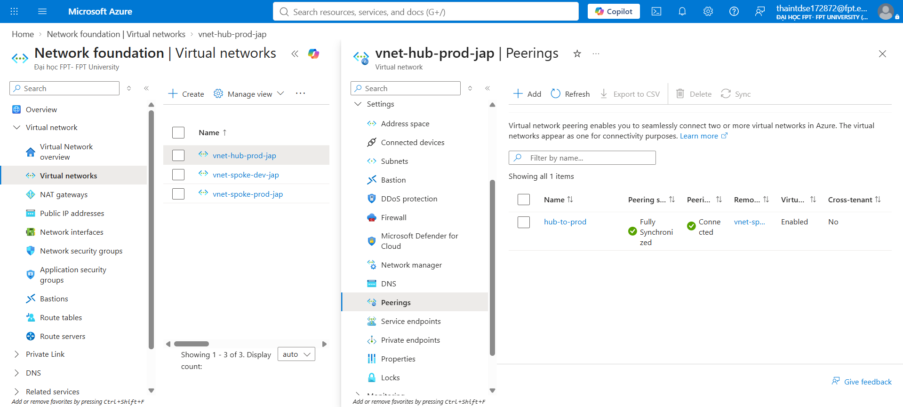
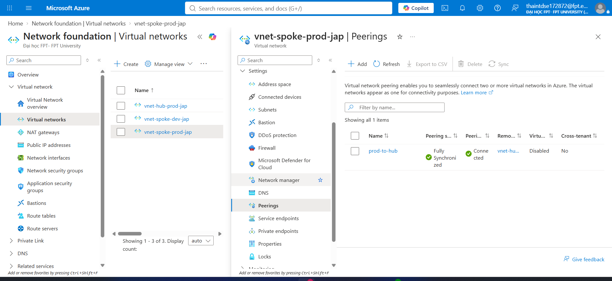

**Network Security** — NSG kiểm soát traffic theo subnet, Application Security Group (ASG) nhóm VM theo vai trò để viết rule linh hoạt hơn theo IP tĩnh.

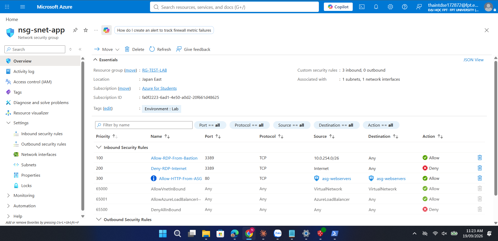
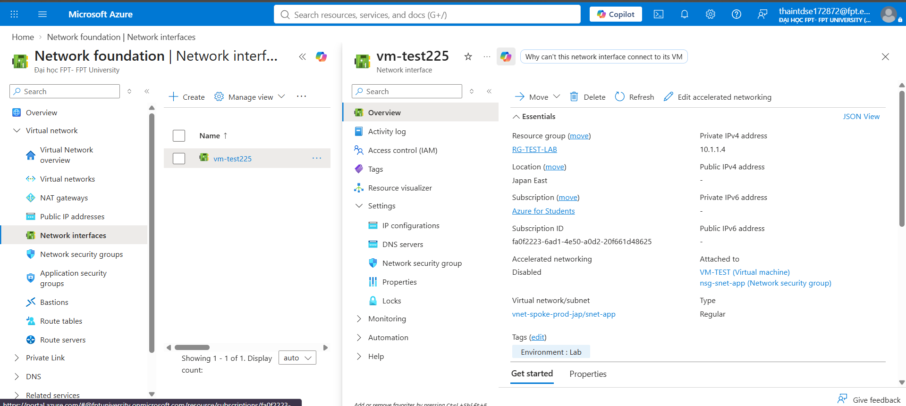

**Azure Bastion** — truy cập RDP/SSH vào VM an toàn, không cần Public IP trên VM.

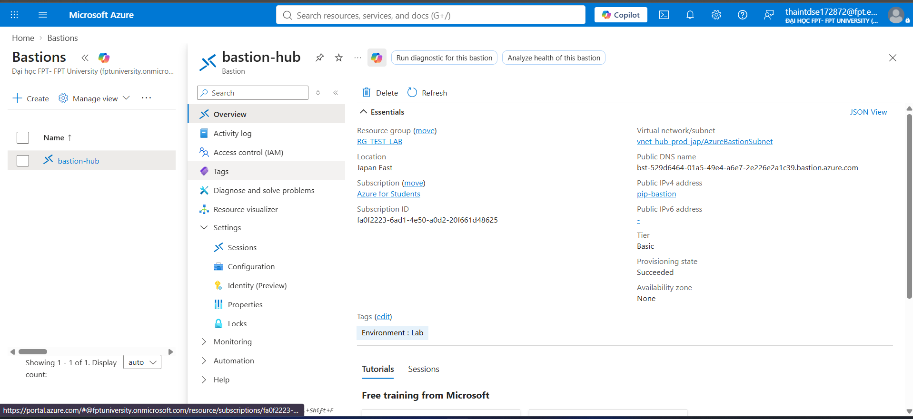
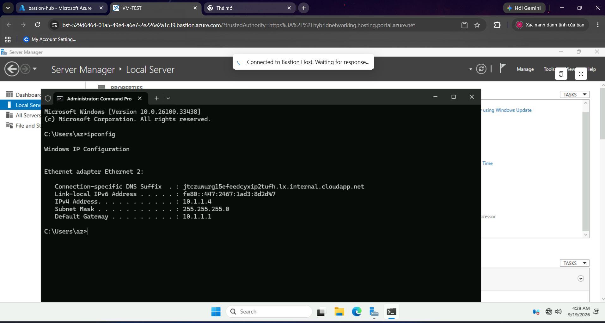

**Point-to-Site VPN** — kết nối từ máy cá nhân về mạng lab qua VPN client, phục vụ truy cập tài nguyên nội bộ không qua Bastion.

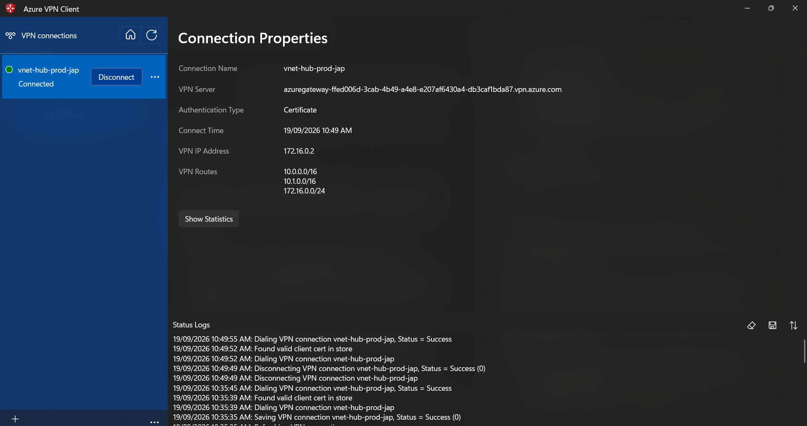
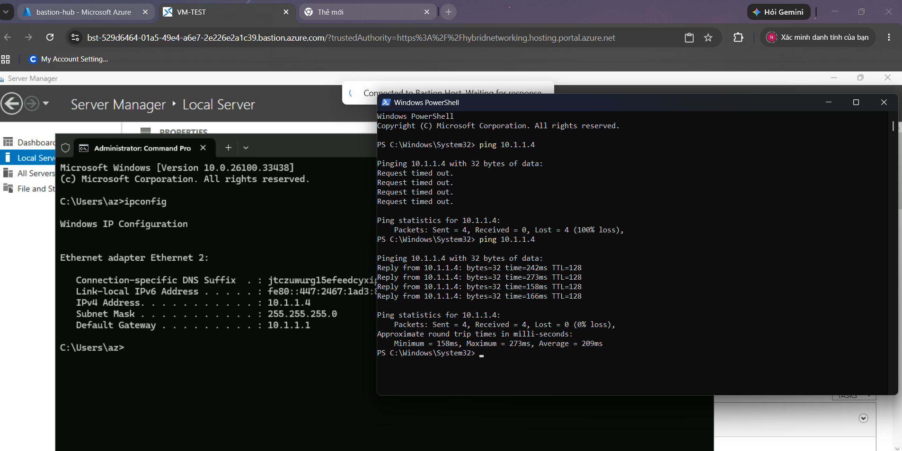

**Chẩn đoán mạng (Network Watcher)** — dùng IP Flow Verify để xác minh traffic có được NSG cho phép hay không, công cụ debug quan trọng khi gặp sự cố kết nối.

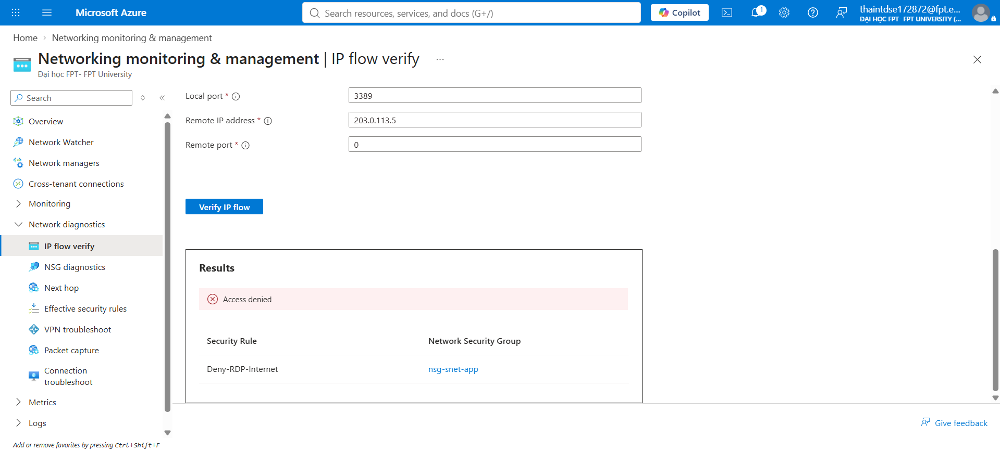
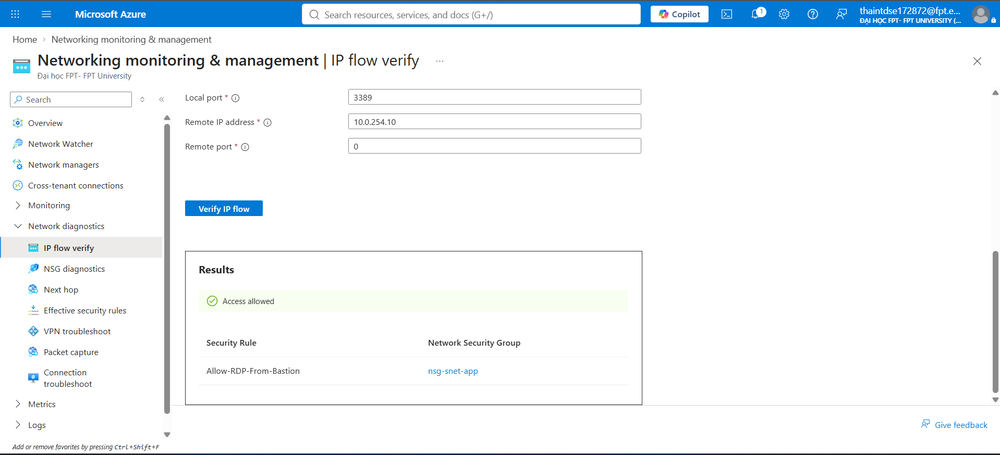

**Private Endpoint** — kết nối riêng tư tới PaaS service (Storage Account), không đi qua Internet công cộng.

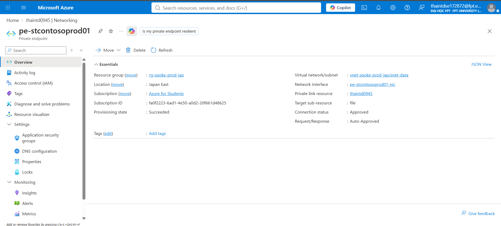

## Kỹ năng thể hiện
Hub-spoke network topology, VNet Peering, NSG & ASG, Azure Bastion, Point-to-Site VPN, Network Watcher (IP Flow Verify) diagnostics, Private Endpoint.

## Bài học thực tế đáng chú ý
Trong quá trình vận hành, gặp và xử lý sự cố **outbound connectivity** do subnet mặc định chuyển sang chế độ "private subnet" (no default outbound access) theo chính sách mới của Azure — đã khắc phục bằng NAT Gateway, đúng khuyến nghị chính thức của Microsoft thay vì dựa vào default outbound access (đang bị deprecate).
