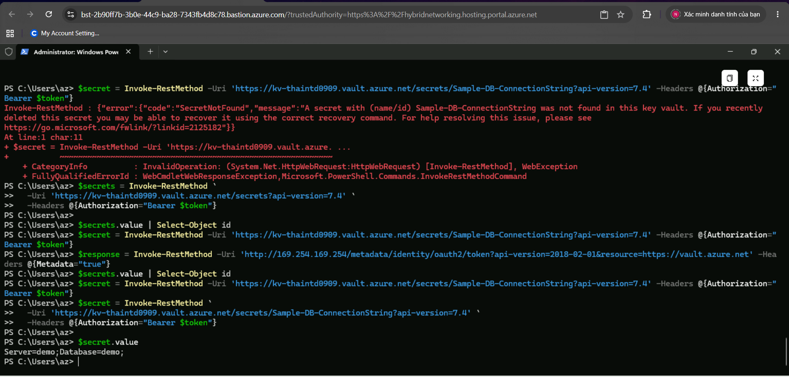
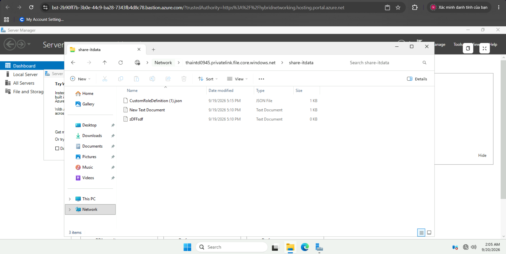
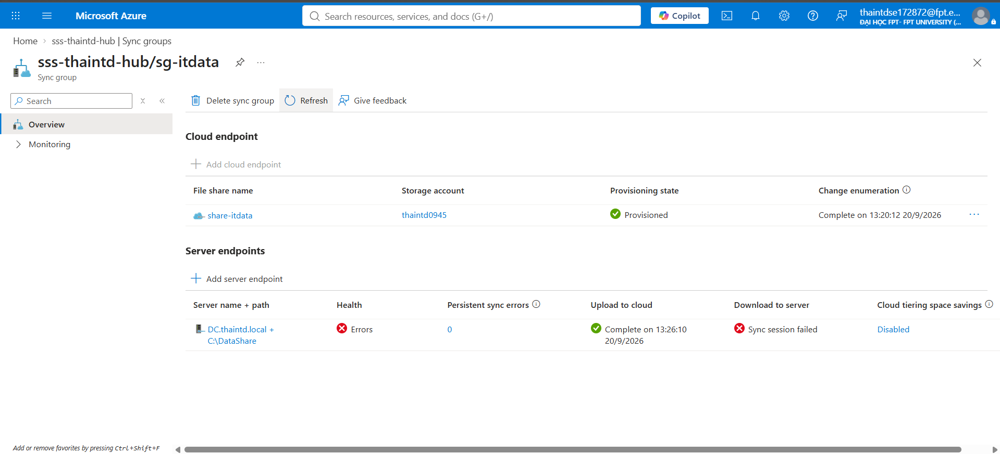

# Phase 3 — Compute & Storage

Triển khai máy ảo, dịch vụ lưu trữ, quản lý bí mật tập trung, và đồng bộ file server on-prem lên cloud.

## Nội dung triển khai

**Virtual Machines** — VM Windows đặt trong các subnet spoke-prod/spoke-dev theo đúng thiết kế network ở Phase 2 (chi tiết cấu hình cụ thể xem trong code Bicep tại `../infra/`).

**Azure Key Vault** — lưu trữ tập trung secret/credential, tránh hardcode trong ứng dụng hoặc script.

**Azure Files + kết nối từ VM/client** — file share trên cloud, verify bằng kết nối thành công từ máy client.

**Azure File Sync** — đồng bộ 2 chiều giữa File Server on-premises và Azure Files, cho phép truy cập file gần (cached) tại chi nhánh trong khi dữ liệu gốc tập trung trên cloud — mô phỏng đúng bài toán doanh nghiệp thật (chi nhánh xa datacenter chính).

## Kỹ năng thể hiện
Azure Virtual Machines, Azure Key Vault (secret management, Managed Identity), Azure Files, Azure File Sync (hybrid file server), Storage Account với Private Endpoint (Phase 2).
