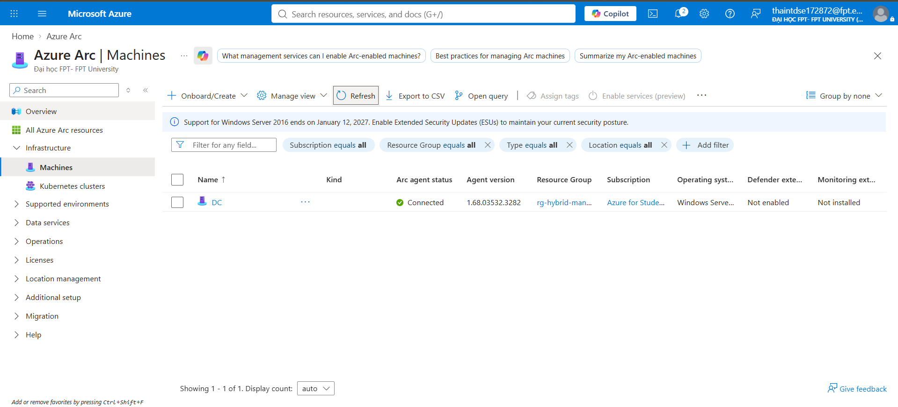

# Phase 4 — Hybrid Management

Mở rộng khả năng quản trị của Azure ra ngoài phạm vi resource native, quản lý cả máy chủ on-premises trong cùng 1 mặt phẳng điều khiển (single pane of glass).

## Nội dung triển khai

**Azure Arc** — onboard Domain Controller on-premises vào Azure Arc, biến máy vật lý/ảo bên ngoài Azure thành 1 "Arc-enabled server" có thể quản lý qua Azure Portal y như VM native: áp policy, giám sát qua Log Analytics, patch qua Update Manager.

## Kỹ năng thể hiện
Azure Arc-enabled servers, hybrid infrastructure management, mở rộng Azure governance/monitoring sang tài nguyên on-premises.

## Ghi chú kỹ thuật
Máy Arc-enabled server **không** thể được quản lý qua Infrastructure as Code (Bicep/Terraform) theo cách thông thường như resource Azure native — việc onboard đòi hỏi chạy script agent trực tiếp trên máy on-prem với Service Principal riêng cho từng tenant, nên phần này được ghi nhận là thao tác thủ công, không nằm trong `infra/` Bicep của project.
