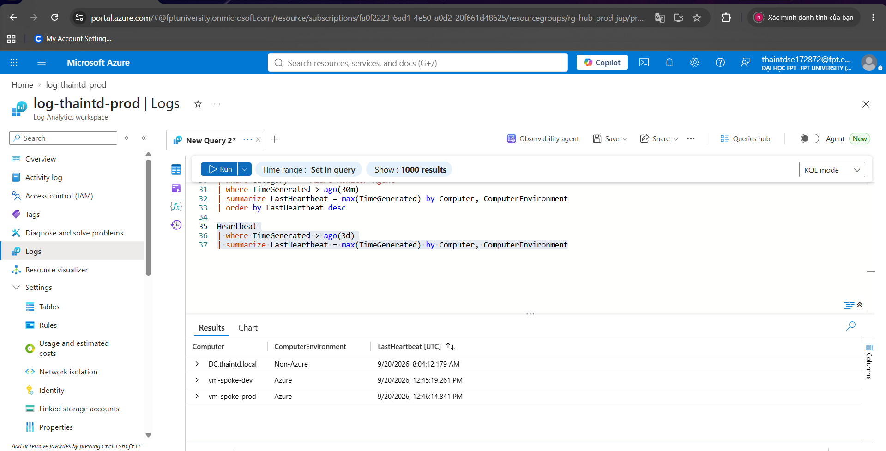
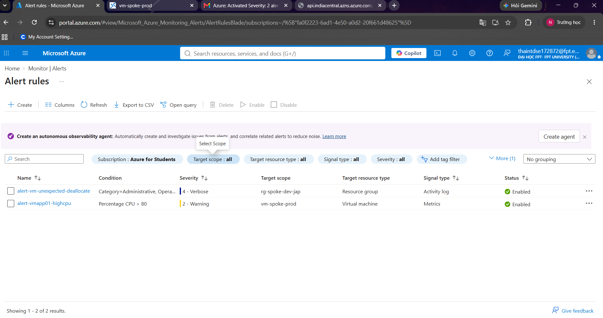
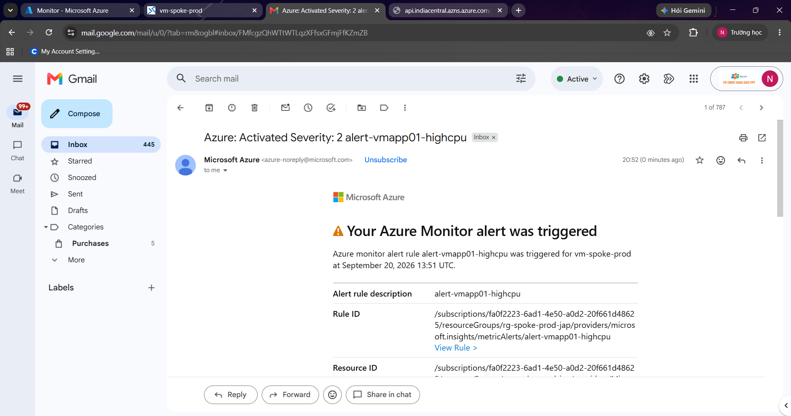
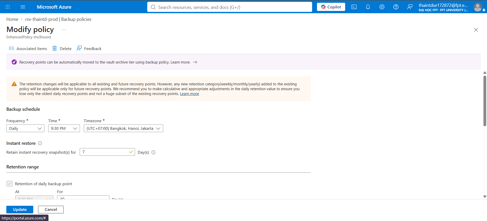
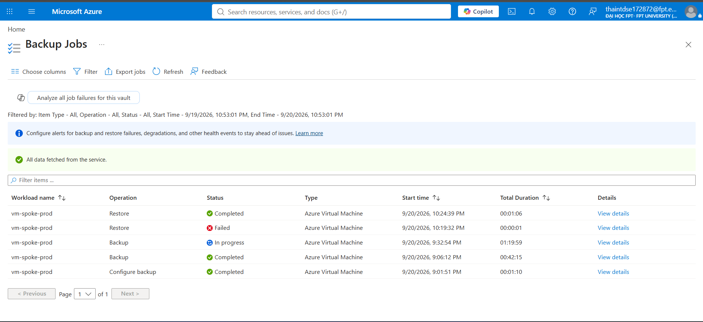
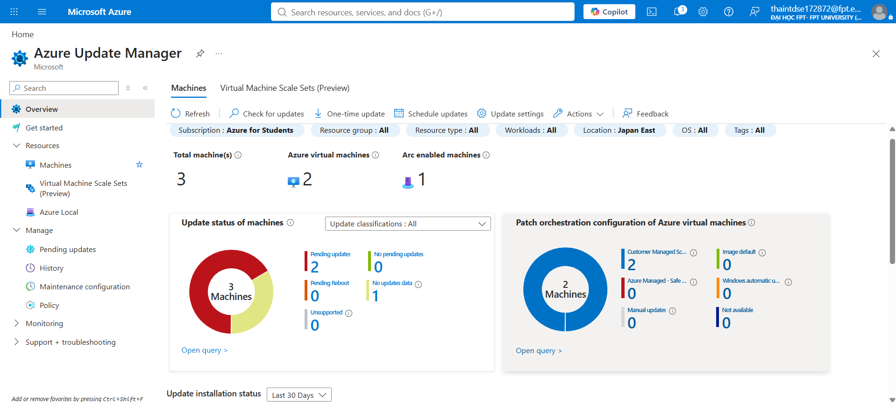

# Phase 5 — Monitoring, Backup & Operations

Vận hành hạ tầng sau khi dựng xong: giám sát tập trung cả tài nguyên cloud lẫn on-premises, cảnh báo chủ động, sao lưu/khôi phục có kiểm chứng, và vá lỗi tự động theo lịch.

## Nội dung triển khai

### Log Analytics — giám sát hợp nhất cloud + on-prem

Một Log Analytics workspace duy nhất nhận log từ cả VM Azure native lẫn máy Arc-enabled server on-prem, chứng minh bằng kết quả truy vấn KQL `Heartbeat` cho thấy cả 3 máy (1 on-prem qua Arc, 2 Azure native) đều đang gửi dữ liệu về cùng workspace, phân biệt rõ qua cột `ComputerEnvironment` (`Azure` / `Non-Azure`).

### Azure Monitor Alerts

Alert rule theo dõi CPU và test thành công bằng cách tạo tải thật trên VM, xác nhận alert chuyển trạng thái "Fired" và gửi được thông báo qua Action Group.

### Azure Backup

Cấu hình chính sách backup định kỳ (daily, retention theo yêu cầu) và xác nhận job backup chạy thành công — không chỉ dừng ở việc cấu hình mà đã kiểm chứng bằng backup job thật.

### Azure Update Manager

Quản lý patch tập trung cho cả VM Azure và máy Arc-enabled server on-prem trong cùng 1 dashboard — thể hiện đúng mô hình "single pane of glass" cho vá lỗi bảo mật xuyên môi trường hybrid.

## Kỹ năng thể hiện
Azure Monitor & Log Analytics (KQL), Data Collection Rules, Azure Monitor Alerts (Metric alert, Action Group), Azure Backup (Recovery Services Vault, policy, restore verification), Azure Update Manager (hybrid patch compliance), giám sát hợp nhất tài nguyên cloud và on-premises qua Azure Arc.

## Bài học thực tế đáng chú ý
Việc kết nối máy on-prem/VM vào Log Analytics gặp hàng loạt sự cố network thực tế (outbound bị chặn do private subnet, NIC-level NSG khác Subnet-level NSG, Managed Identity chưa bật) — được debug có hệ thống bằng `Test-NetConnection`, Effective Security Rules, và Effective Routes trước khi xác định đúng nguyên nhân gốc. Đây là kinh nghiệm troubleshooting network thực tế, không chỉ làm theo hướng dẫn.
